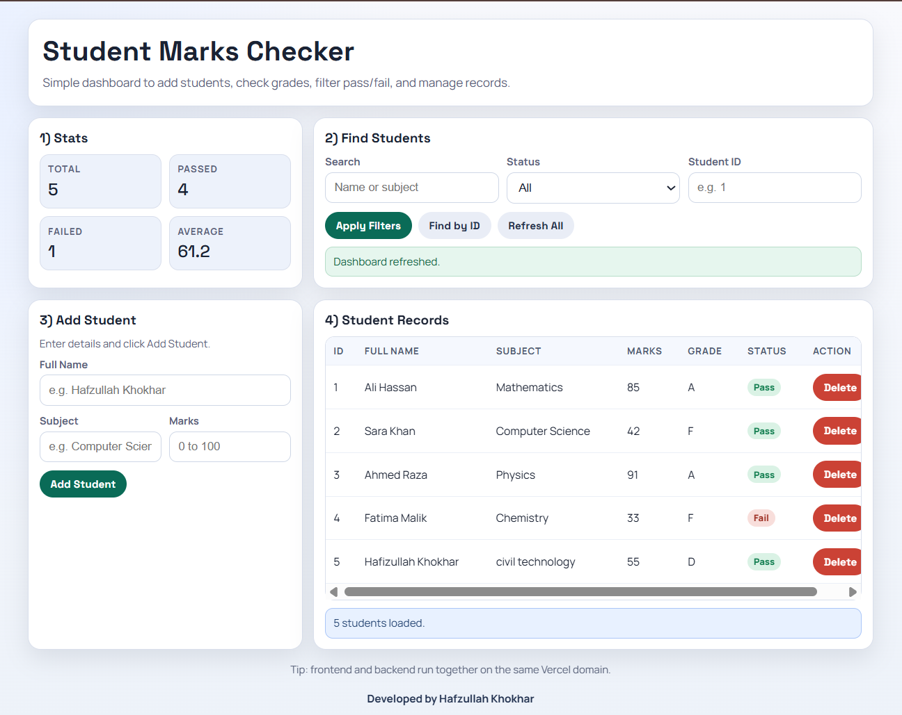

# Student Result Checker

A complete student marks checker website with:

- A structured Express backend API
- A responsive frontend dashboard
- Student CRUD and filtering
- Stats summary with grades and pass or fail status

## Features

- Add student with full name, subject, and marks
- View all students in a table
- Filter by pass or fail status and search by name or subject
- Lookup one student by ID
- Delete student records
- Health and analytics endpoints

## Tech Stack

- Backend: Node.js, Express, CORS
- Frontend: HTML, CSS, vanilla JavaScript

## Project Structure

- api/index.js
- backend/server.js
- backend/package.json
- backend/test.http
- frontend/index.html
- vercel.json

## Run Locally

1. Go to project root folder.
2. Install dependencies.
3. Start backend.
4. Open frontend/index.html in browser or serve it with Live Server.

Commands:

PowerShell

cd learn-api-project
npm install
npm run start

Backend default URL: http://localhost:3000

## Live Website

- Production URL: https://studentresultchecker.vercel.app

## App Screenshot

Add your screenshot image file in `docs/` folder (example: `docs/studentresultchecker-home.png`) and then use this line:

## API Endpoints

- GET /api/health
- GET /api/stats
- GET /api/students
- GET /api/students/:id
- POST /api/students
- PUT /api/students/:id
- DELETE /api/students/:id

## Deployment Plan (Vercel Full Stack)

This project is configured to deploy frontend and backend together on one Vercel domain.

1. Import GitHub repo: `HafizullahKhokhar1/Student-Result-Checker`
2. Branch: `main`
3. Framework Preset: `Other`
4. Root Directory: `./`
5. Install Command: leave default (`npm install`)
6. Build Command: leave empty
7. Output Directory: leave empty
8. Deploy

After deployment, verify:

- `https://your-project.vercel.app/`
- `https://your-project.vercel.app/api/health`

## Notes

- Current data is stored in memory and resets on server restart.
- You can later connect MongoDB or PostgreSQL for persistent data.
